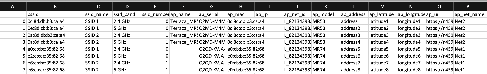

# merakiBssidExporter
Obtain all BSSIDs in a Meraki Organization for E911 audits

## Use case:
Some organizations will have IP telephony systems that rely on BSSID information to populate their system to quickly correlate calls placed from wireless clients or phones, with the BSSID of the network they were connected to and additional information like address, latitude, longitude, etc.

This script will obtain all BSSIDs in a Cisco Meraki organization and build a CSV file containing supplementary information including:
* AP Name
* SSID Name
* SSID Band
* AP Serial
* AP MAC
* AP IP Address
* AP Model
* AP Physical Address (if configured in the Meraki Dashboard)
* AP Latitude (if configured in the Meraki Dashboard)
* AP Longitude (if configured in the Meraki Dashboard)
* AP URL
* AP Network ID
* AP Network Name

A sample output csv file looks like the image below. 

## How to Use

1. Issue `git clone https://github.com/Francisco-1088/merakiBssidExporter.git` from your terminal
2. Edit the `config.py` file and enter your Meraki API Key between the quotation marks next to `api_key=`
3. Run `pip install -r requirements.txt`
4. Run `python main.py`
5. When prompted, enter the number of the organization you wish to work on (if your API Key has access to a single organization, this number will be `0`)
6. If the script runs successfully, a `bssids.csv` file will be output to your working directory
